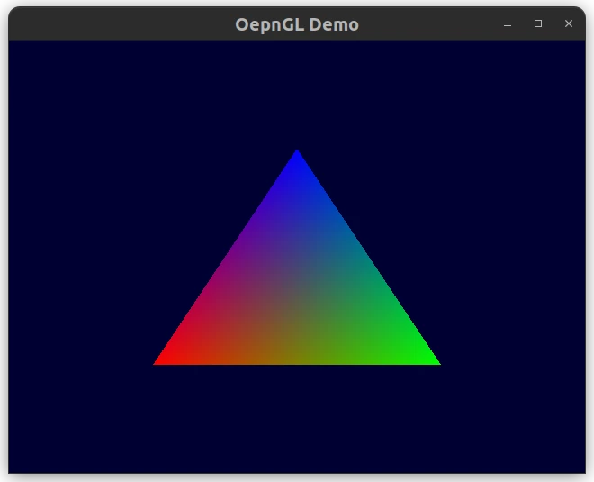

# OpenGL Demo
OpenGL demo written in C++ using OpenGL.



## Install GLFW dependencies
```
sudo apt install libglfw3 libglfw3-dev 
```

## Install GLEW dependencies
```
sudo apt install libglew-dev
```

## Install SDL_mixer dependencies
```
sudo apt install libsdl2-dev libsdl2-mixer-dev
```

## Test OpenGL Works
Write simple OpenGL code to draw a triangle to test that OpenGL works.
```
/* Render here */
glClear(GL_COLOR_BUFFER_BIT);

// Draw triangle to test OpenGL works
glBegin(GL_TRIANGLES);
glVertex2f(-0.5f, -0.5f);
glVertex2f(0.0f, 0.5f);
glVertex2f(0.5f, -0.5f);
glEnd();

/* Swap front and back buffers */
glfwSwapBuffers(window);
```

## Useful Resources
- [learnopengl](https://learnopengl.com/Getting-started/Hello-Triangle)
